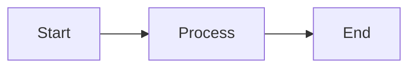

# Dokumentasjons-hurtigguide

## 🚀 Start dokumentasjonen lokalt

### Installer avhengigheter

```bash
pip install -r docs/requirements.txt
```

### Kjør lokal server

```bash
npm run docs:serve
```

eller direkte:

```bash
mkdocs serve
```

Åpne http://localhost:8000 i nettleseren.

## 📚 Dokumentasjonsstruktur

```
docs/
├── index.md                          # Hjem (landing page)
├── getting-started/                  # Kom i gang
│   ├── installation.md              # Installasjonsinstruksjoner
│   ├── quickstart.md                # Rask start-guide
│   └── configuration.md             # Konfigurasjon
├── user-guide/                       # Brukerguide (TODO)
│   ├── overview.md
│   ├── authentication.md
│   ├── data-collection.md
│   ├── visualization.md
│   └── data-export.md
├── architecture/                     # Arkitektur
│   ├── overview.md                  # System oversikt ✅
│   ├── components.md                # Komponentstruktur (TODO)
│   ├── data-flow.md                 # Dataflyt (TODO)
│   └── file-structure.md            # Filstruktur (TODO)
├── developer-guide/                  # Utviklerguide (TODO)
│   ├── setup.md
│   ├── code-standards.md
│   ├── adding-creditor.md
│   ├── testing.md
│   └── debugging.md
├── api/                              # API-referanse
│   ├── core-modules.md              # Hovedmoduler ✅
│   ├── scraper.md                   # Scraper API (TODO)
│   ├── schemas.md                   # Zod schemas (TODO)
│   ├── creditor-scrapers.md         # Kreditor scrapers (TODO)
│   └── utilities.md                 # Utilities (TODO)
├── creditors/                        # Kreditor-dokumentasjon (TODO)
│   ├── supported.md
│   ├── intrum.md
│   ├── kredinor.md
│   ├── si.md
│   ├── tfbank.md
│   └── digipost.md
├── security/                         # Sikkerhet (TODO)
│   ├── privacy.md
│   ├── data-handling.md
│   └── best-practices.md
├── contributing/                     # Bidrag
│   ├── guidelines.md                # Bidragsretningslinjer ✅
│   ├── code-contributions.md        # Kode-bidrag (TODO)
│   └── bug-reports.md               # Bug-rapporter (TODO)
├── faq.md                            # FAQ ✅
├── changelog.md                      # Endringslogg ✅
├── requirements.txt                  # Python-avhengigheter
└── README.md                         # Dokumentasjons-README
```

## ✅ Fullførte dokumenter

- **index.md** - Hjemmeside med oversikt
- **getting-started/installation.md** - Komplett installasjonsguide
- **getting-started/quickstart.md** - Rask start-guide
- **getting-started/configuration.md** - Konfigurasjon
- **architecture/overview.md** - Systemarkitektur
- **api/core-modules.md** - API for hovedmoduler
- **faq.md** - Ofte stilte spørsmål
- **changelog.md** - Endringslogg
- **contributing/guidelines.md** - Bidragsretningslinjer

## 📝 Gjenværende dokumenter (TODO)

Følgende dokumenter bør opprettes for fullstendig dokumentasjon:

### User Guide
- `user-guide/overview.md` - Brukerguide oversikt
- `user-guide/authentication.md` - BankID og autentisering
- `user-guide/data-collection.md` - Datainnsamlingsprosess
- `user-guide/visualization.md` - Visualisering av data
- `user-guide/data-export.md` - Eksport og bruk av data

### Architecture
- `architecture/components.md` - Detaljert komponentbeskrivelse
- `architecture/data-flow.md` - Dataflytdiagrammer
- `architecture/file-structure.md` - Filsystemoversikt

### Developer Guide
- `developer-guide/setup.md` - Utviklingsmiljø
- `developer-guide/code-standards.md` - Kodestandard
- `developer-guide/adding-creditor.md` - Legge til ny kreditor
- `developer-guide/testing.md` - Testing-guide
- `developer-guide/debugging.md` - Debugging-tips

### API Reference
- `api/scraper.md` - Scraper API dokumentasjon
- `api/schemas.md` - Zod schema dokumentasjon
- `api/creditor-scrapers.md` - Kreditor-spesifikke API-er
- `api/utilities.md` - Hjelpefunksjoner

### Creditors
- `creditors/supported.md` - Oversikt over kreditorer
- `creditors/intrum.md` - Intrum-dokumentasjon
- `creditors/kredinor.md` - Kredinor-dokumentasjon
- `creditors/si.md` - SI-dokumentasjon
- `creditors/tfbank.md` - tfBank-dokumentasjon
- `creditors/digipost.md` - Digipost-dokumentasjon

### Security
- `security/privacy.md` - Personvern og datasikkerhet
- `security/data-handling.md` - Datahåndtering
- `security/best-practices.md` - Beste praksis

### Contributing
- `contributing/code-contributions.md` - Guide for kodebidrag
- `contributing/bug-reports.md` - Rapportere bugs

## 🎨 Dokumentasjonsstil

### Markdown-funksjoner

Dokumentasjonen støtter:

- ✅ **Admonitions**: `!!! note`, `!!! warning`, `!!! tip`
- ✅ **Code highlighting**: ```javascript, ```python, ```bash
- ✅ **Tabs**: `=== "Windows"` for plattform-spesifikt innhold
- ✅ **Icons**: `:material-icon:`, `:fontawesome-brands-github:`
- ✅ **Tables**: Markdown tabeller
- ✅ **Mermaid diagrams**: Flytdiagrammer og sekvensdiagrammer

### Eksempler

#### Admonition

```markdown
!!! warning "Viktig sikkerhetsinformasjon"
    Denne applikasjonen håndterer sensitive data. Pass på at maskinen din er sikret.
```

#### Faner (tabs)

```markdown
=== "Windows"
    Windows-spesifikk instruksjon her

=== "macOS"
    macOS-spesifikk instruksjon her

=== "Linux"
    Linux-spesifikk instruksjon her
```

#### Mermaid diagram

````markdown

````

## 🔧 Bygg og deploy

### Lokal forhåndsvisning

```bash
mkdocs serve
```

### Bygg statisk site

```bash
mkdocs build
```

Output genereres i `site/` mappen.

### Deploy til GitHub Pages

```bash
mkdocs gh-deploy
```

Dette bygger og pusher til `gh-pages` branch automatisk.

## 📦 Avhengigheter

Dokumentasjonen bruker:

- **MkDocs** (>=1.5.0) - Statisk site-generator
- **Material for MkDocs** (>=9.5.0) - Material Design-tema
- **PyMdown Extensions** (>=10.0) - Utvidelser for Markdown

Installer med:

```bash
pip install -r docs/requirements.txt
```

## 🌐 Publisering

Dokumentasjonen kan publiseres til:

1. **GitHub Pages** (anbefalt)
   ```bash
   npm run docs:deploy
   ```

2. **ReadTheDocs**
   - Koble GitHub-repo til ReadTheDocs
   - Automatisk bygging ved push

3. **Netlify/Vercel**
   - Deploy `site/`-mappen
   - Automatisk preview for PRs

## 🤝 Bidra til dokumentasjonen

1. Fork repositoriet
2. Opprett branch: `git checkout -b docs/new-section`
3. Skriv dokumentasjon i Markdown
4. Test lokalt: `mkdocs serve`
5. Commit og push: `git commit -m "docs: legg til ny seksjon"`
6. Opprett Pull Request

## 📞 Hjelp

- **MkDocs:** https://www.mkdocs.org/
- **Material:** https://squidfunk.github.io/mkdocs-material/
- **Markdown guide:** https://www.markdownguide.org/

---

**Status:** 📊 Ca. 40% fullført (10/24 dokumenter)

**Prioritet:**
1. Fullfør User Guide
2. Fullfør API Reference
3. Fullfør Developer Guide
4. Legge til Security-dokumentasjon
