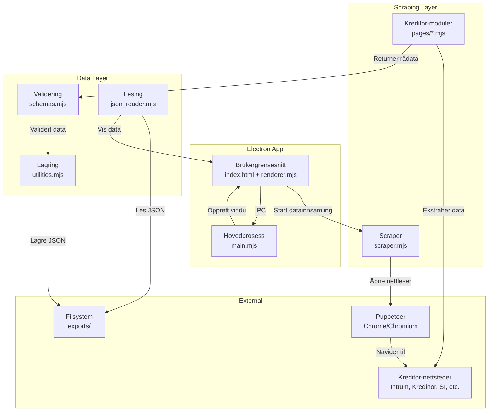
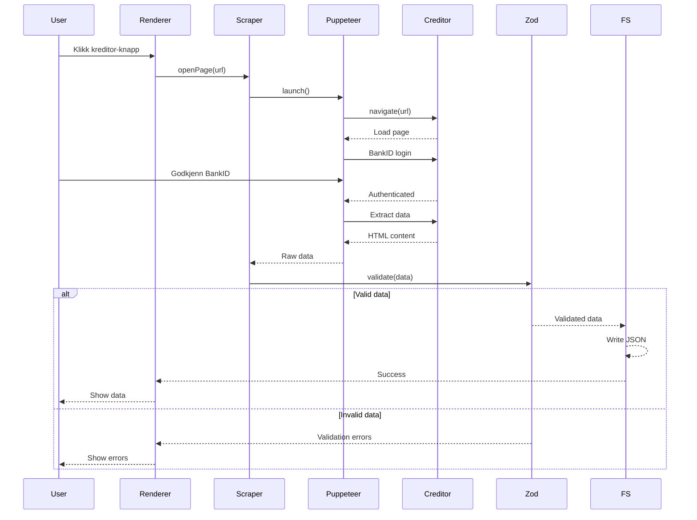
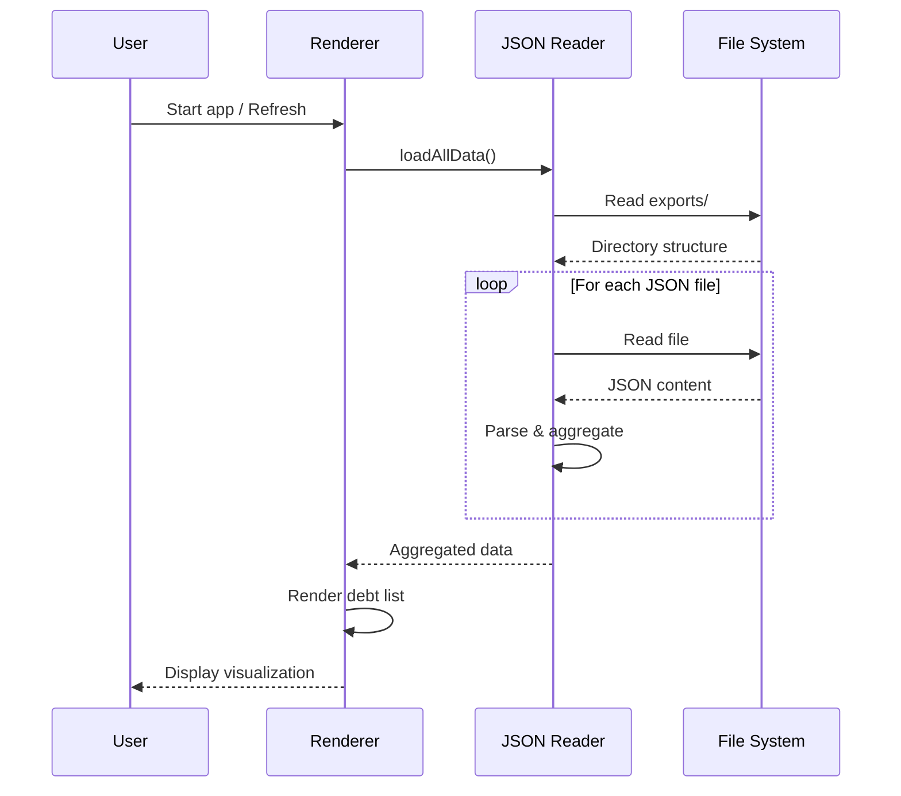
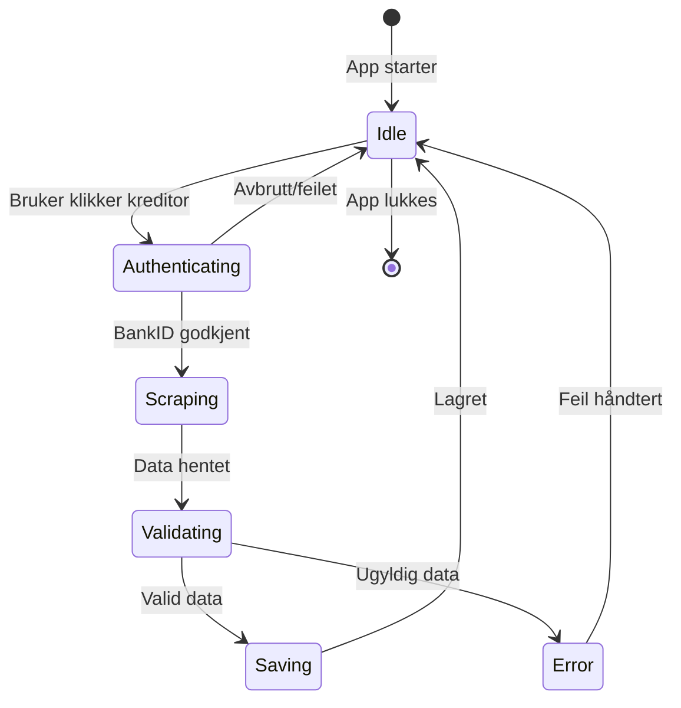
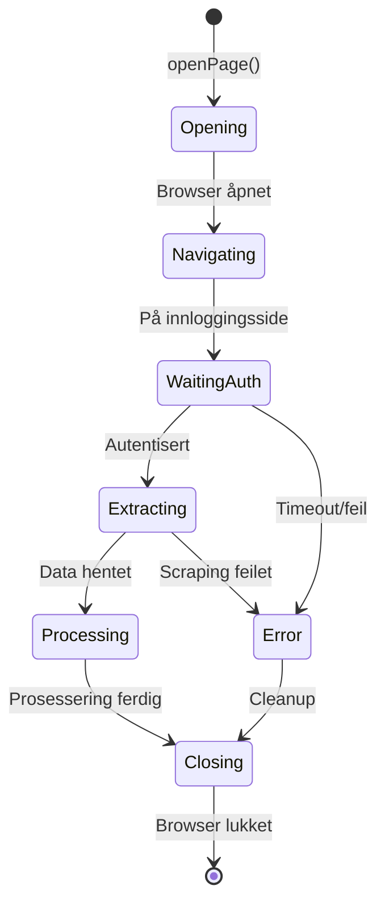

# System oversikt

Dette dokumentet gir en høynivå oversikt over Gjeld i Norge sin arkitektur og designbeslutninger.

## :material-chart-bubble: Arkitekturdiagram



## :material-layers: Arkitekturlag

### 1. Presentasjonslag (UI)

**Ansvar:** Brukerinteraksjon og datavisualisering

**Komponenter:**
- `index.html` - HTML-struktur
- `renderer.mjs` - UI-logikk og event handlers
- `dom.mjs` - DOM-manipulering
- `styles.css` - Visuell styling

**Teknologier:**
- Vanilla JavaScript (ES Modules)
- HTML5
- CSS3

### 2. Applikasjonslag

**Ansvar:** Forretningslogikk og orkestrering

**Komponenter:**
- `main.mjs` - Electron hovedprosess
- `data.mjs` - Konfigurasjon av kreditorer

**Teknologier:**
- Electron API
- Node.js

### 3. Scraping-lag

**Ansvar:** Nettleserautomatisering og datautvinning

**Komponenter:**
- `scraper.mjs` - Puppeteer wrapper
- `pages/*.mjs` - Kreditor-spesifikke scrapers

**Teknologier:**
- Puppeteer
- Chrome DevTools Protocol

### 4. Datalag

**Ansvar:** Datavalidering, transformering og persistering

**Komponenter:**
- `schemas.mjs` - Zod valideringsskjemaer
- `utilities.mjs` - Fil-I/O operasjoner
- `json_reader.mjs` - Dataparsing

**Teknologier:**
- Zod (runtime validation)
- Node.js fs module

## :material-ab-testing: Design-prinsipper

### 1. Separation of Concerns

Hver modul har et klart definert ansvar:

```
scraper.mjs     → Nettleserautomatisering
intrum.mjs      → Intrum-spesifikk logikk
schemas.mjs     → Datavalidering
utilities.mjs   → Filhåndtering
```

### 2. Modulær arkitektur

Nye kreditorer kan legges til uten å endre eksisterende kode:

```javascript
// Ny kreditor: tfbank.mjs
export async function scrapeTfBank(page, identifikasjon) {
  // Implementering
}
```

### 3. Type Safety (Runtime)

Zod sikrer dataintegritet uten TypeScript:

```javascript
const IntrumDebtCaseSchema = z.object({
  caseNumber: z.string().min(1),
  totalAmount: z.string().min(1),
  creditorName: z.string().min(1),
});

// Validering feiler hvis data er ugyldig
const validated = IntrumDebtCaseSchema.parse(rawData);
```

### 4. Fail-Safe Design

Applikasjonen håndterer feil gracefully:

- Valideringsfeil stopper ikke hele prosessen
- Delvis data lagres for debugging
- Nettleseren forblir åpen ved feil for manuell inspeksjon

## :material-connection: Dataflyt

### Innsamlingsflyt



### Leseflyt



## :material-package: Avhengigheter

### Kjerneavhengigheter

| Pakke | Versjon | Formål |
|-------|---------|--------|
| `electron` | 39.1.1 | Desktop app ramme |
| `puppeteer` | 24.29.1 | Nettleserautomatisering |
| `zod` | 4.1.12 | Runtime type validation |
| `pdf-parse` | 2.4.5 | PDF-dokumentparsing |

### Avhengighetsgrafer

```
gjeld-i-norge
├── electron (Desktop app)
│   └── chromium (Embedded)
├── puppeteer (Browser automation)
│   └── chromium (Downloaded separately)
├── zod (Validation)
└── pdf-parse (PDF processing)
    ├── node-ensure
    └── debug
```

## :material-security: Sikkerhetstopologi

### Dataflyt og tilgangskontroll

```
┌─────────────────────────────────────────┐
│           Brukerens maskin              │
│                                         │
│  ┌──────────────────────────────────┐  │
│  │    Electron App (Trusted)        │  │
│  │  • Full filesystem access        │  │
│  │  • Process execution             │  │
│  │  • Browser control               │  │
│  └──────────────────────────────────┘  │
│              ↕                          │
│  ┌──────────────────────────────────┐  │
│  │  Puppeteer Browser (Isolated)    │  │
│  │  • Sandboxed execution           │  │
│  │  • Network access only           │  │
│  │  • No filesystem access          │  │
│  └──────────────────────────────────┘  │
│              ↕                          │
└─────────────────────────────────────────┘
              ↕ HTTPS
┌─────────────────────────────────────────┐
│      Kreditor-nettsteder (Untrusted)    │
│      • Intrum.no                        │
│      • Kredinor.no                      │
│      • SI.no                            │
└─────────────────────────────────────────┘
```

**Sikkerhetslag:**

1. **Nettverknivå:** HTTPS for all kommunikasjon
2. **Browsernivå:** Puppeteer sandbox isolerer nettstedskode
3. **Appnivå:** Electron kontrollerer nettleserens tilganger
4. **Datanivå:** Kun lokal lagring, ingen ekstern sending

## :material-state-machine: Tilstandsmaskin

### Applikasjonstilstander



### Scraping-tilstander



## :material-scale-balance: Skalerbarhet

### Nåværende begrensninger

- **Sekvensiell prosessering:** Én kreditor om gangen
- **Single-user:** Kun én bruker per kjøring
- **Lokal lagring:** Begrenset av diskplass
- **Minnebruk:** Chromium prosesser er ressurskrevende

### Fremtidig utvidelsesmuligheter

1. **Multi-threading:** Parallell datainnsamling med worker threads
2. **Database:** SQLite/PostgreSQL for bedre queries
3. **API:** REST/GraphQL for eksterne integrasjoner
4. **Cloud-backup:** Kryptert backup til sky (opt-in)
5. **Multi-user:** Support for flere brukerprofiler

## :material-puzzle: Utvidbarhet

### Plugin-arkitektur (fremtidig)

```javascript
// Plugin interface
export interface CreditorPlugin {
  name: string;
  url: string;
  authenticate(page): Promise<void>;
  scrape(page): Promise<DebtData>;
  validate(data): DebtData;
}

// Automatisk loading
const plugins = await loadPlugins('./plugins');
plugins.forEach(plugin => registerCreditor(plugin));
```

### Event-system (fremtidig)

```javascript
// Emit events for monitoring
eventBus.on('scraping:start', (creditor) => {
  log(`Started scraping ${creditor}`);
});

eventBus.on('data:validated', (data) => {
  analytics.track(data);
});
```

## :material-monitor-dashboard: Monitoring og logging

### Nåværende tilstand

- Console.log for debugging
- Ingen strukturert logging
- Ingen metrics collection

### Anbefalte forbedringer

```javascript
// Strukturert logging
import winston from 'winston';

const logger = winston.createLogger({
  level: 'info',
  format: winston.format.json(),
  transports: [
    new winston.transports.File({ filename: 'error.log', level: 'error' }),
    new winston.transports.File({ filename: 'combined.log' }),
  ],
});

// Metrics
import { Counter, Histogram } from 'prom-client';

const scrapingDuration = new Histogram({
  name: 'scraping_duration_seconds',
  help: 'Time to scrape creditor data',
  labelNames: ['creditor'],
});
```

## :material-arrow-right: Neste steg

- [Komponentstruktur](components.md) - Detaljert komponentbeskrivelse
- [Dataflyt](data-flow.md) - Dypere dive i databehandling
- [Filstruktur](file-structure.md) - Komplett filsystemoversikt
